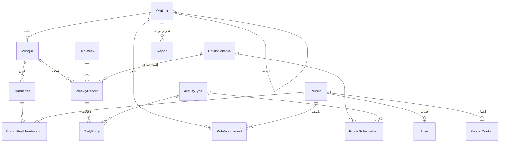

# نموذج البيانات الأولي — منصة «المسجد المؤثر»

**الإصدار:** 0.2 (محدّثة بقرارات الإدارة) — انظر [سجل القرارات](05_decisions_log.md)
**الغرض:** هذا المخطط هو البديل العملي عن SRD التقليدي في هذه المرحلة؛ يثبّت الكيانات والعلاقات والقرارات المعمارية، وتفاصيل الحقول النهائية تُقر أثناء التنفيذ.

> **وحدتان لهما وثيقتا تفصيل منفصلتان:** [وحدة «على بصيرة»](06_module_ala_baseera.md) (المعلّم/الحلقة/المحاسبة بالساعة) و[وحدة المالية](07_module_finance.md) (النقاط/الساعات ← مستحقات). ما يلي يغطي النواة ويشير إليهما.

---

## 1. قرارات معمارية حاكمة

1. **الهيكلية شجرة واحدة:** كيان `OrgUnit` ذاتي الارتباط (رابطة ← كتلة ← مربع ← مسجد) مع حقل `gender_track` (رجالي/نسائي) — يستوعب أي عمق مستقبلي (مناطق جديدة، آلاف المساجد) دون تغيير المخطط. نخزن `path` بـ**المسار المادّي النصّي** (Materialized Path، مثل `/1/4/12/`) لاستعلامات «كل ما تحت نطاقي» بـ`LIKE` (متوافق مع Cloudflare D1/SQLite المعتمدة — انظر [خطة البناء](08_tech_build_plan.md)).
2. **الأدوار تكليفات مؤقتة لا صفات دائمة:** `RoleAssignment(person, role, org_unit, start, end)` — يدعم الدورة الإدارية (سنتان/دورتان)، التدوير، تعدد الأدوار للشخص الواحد، والتاريخ الكامل للتكليفات.
3. **التواريخ هجرية وميلادية معاً:** كل تاريخ يُخزن ميلادياً (UTC) **مع** حقول هجرية محسوبة ومخزنة (`hijri_year/month/day`)، والأسبوع التشغيلي يبدأ **السبت** كما في السجل الورقي. كيان `HijriWeek` مرجعي موحد يمنع اختلاف الحسابات بين الأجهزة.
4. **نظام النقاط بالإعدادات لا بالكود:** `ActivityType` و`PointsScheme` مُصدَّران (versioned)؛ تغيير الأوزان لاحقاً لا يعيد كتابة التاريخ، لأن كل إدخال يشير إلى إصدار المخطط الساري وقتها. **ولكل مسار جنس (`gender_track`) مجموعة أنشطة ومخطط نقاط مستقل** (ق6): مجموعة الرجال ومجموعة النساء تختلفان في الأنشطة لا في هدف الـ70.
4.ب **النقاط = مال، والتعويض شهري تلقائي (ق2):** المستحق = Σ نقاط الشهر الهجري × معدّل النقطة؛ فلا حقل «تعويض» منفصل — الجمع الشهري يحقق التعويض تلقائياً، ولا قيمة لأي تعويض بعد انتهاء الشهر.
5. **Offline-first:** كل جدول إدخال ميداني يحمل `client_uuid` (يولده الجهاز)، `recorded_at` (وقت الفعل)، `synced_at` (وقت الوصول للخادم)، ورقم إصدار للتعارضات. سياسة الدمج: آخر كتابة لنفس (المسجد، اليوم، النشاط) تكسب مع حفظ النسخ في سجل التدقيق.
6. **سجل تدقيق شامل:** `AuditLog` يسجل كل إنشاء/تعديل/حذف (من، متى، القيمة قبل وبعد). الحذف منطقي (`deleted_at`) لا فعلي.
7. **خصوصية بالتصميم:** حقول الاتصال (هاتف) في جدول منفصل بصلاحيات أضيق؛ لا حقول «عنوان تفصيلي» للأفراد — الحد الأدنى من البيانات.

## 2. الكيانات — المرحلة 0 (الأساس)

### OrgUnit — الوحدة التنظيمية
| حقل | ملاحظة |
|---|---|
| id, parent_id, path | شجرة |
| type | رابطة / كتلة / مربع / مسجد |
| gender_track | رجالي / نسائي |
| name, city, district | — |
| status | نشط / قيد التفعيل / موقوف |

### Mosque — ملف المسجد (امتداد لـ OrgUnit من نوع مسجد)
| حقل | ملاحظة |
|---|---|
| org_unit_id | 1:1 |
| joined_at, onboarding_course_done | ملف المسابقة: الجهة المنضمة «تخضع لدورة في آليات التنفيذ» |
| facilities | مرافق (مكتب، صالة، مصلى نساء…) — المادة 6 |

### Person — الشخص
| حقل | ملاحظة |
|---|---|
| id, full_name, gender | — |
| birth_year_hijri | شروط السن: أمير ≥22هـ (المادة 10)، عضو ≥18هـ (المادة 11)، مشترك مسابقة 15–40 |
| home_org_unit_id | مسجد الحي |
| status | نشط / منسحب / فاقد عضوية (المادة 14) |

### PersonContact — بيانات الاتصال (جدول منفصل، صلاحيات أضيق)
phone, telegram/whatsapp, guardian_phone (لمن دون 18)

### User — حساب الدخول
person_id, login, password_hash, last_login, mfa? (للمستويات العليا)

### Role + RoleAssignment — التكليفات
| حقل (RoleAssignment) | ملاحظة |
|---|---|
| person_id, role_id, org_unit_id | الدور × النطاق |
| portfolio | الحقيبة (نائب/سر/صندوق/لجنة X) — المادة 17 |
| start_date, end_date | الدورة سنتان |
| term_number | لمنع دورة ثالثة بنفس الحقيبة (الباب الخامس) |
| approval_status, approved_by | مسار مصادقة الأمير (المادة 15) |

### Committee + CommitteeMembership — اللجان التسع وعضويتها داخل كل مسجد (المواد 17، 24–33)

## 3. الكيانات — المرحلة 1 (MVP: السجل والنقاط والتقارير)

### ActivityType — نوع النشاط
code, name, default_points, category, **gender_track** (رجالي/نسائي/كلاهما — ق6), active. أنشطة الرجال (الثمانية) وأنشطة النساء (زيارة دعوية، جولات، توزيع حجابات، إقناع بالحجاب، حضور دروس، إلقاء/ملتقيات) مجموعتان متمايزتان.

### PointsScheme + PointsSchemeItem — إصدار أوزان النقاط
scheme: valid_from, weekly_target (70), **gender_track** · item: activity_type_id, points. (مخطط مستقل لكل مسار جنس.)

### WeeklyRecord — سجل أسبوع لمسجد
| حقل | ملاحظة |
|---|---|
| mosque_id, hijri_week_id | فريد معاً |
| points_scheme_id | الإصدار الساري |
| total_points, status | مسودة / مكتمل / معتمد |
| notes | عمود «ملاحظات وإضافات» الورقي |

### DailyEntry — الإدخال اليومي (قلب النظام)
| حقل | ملاحظة |
|---|---|
| weekly_record_id, day (سبت–جمعة) | — |
| activity_type_id, count, points | درسان = 4 نقاط |
| note | — |
| shura_confirmed | إقرار «تم بإشراك الأسرة» (التوطئة) |
| **entered_by**, **entered_by_committee_id** | من أدخل: أمير/نائب/لجنة (ق1) |
| **approval_status** | مُدخل → مُقَرّ من الأمير → مُقَرّ من أعلى طبقة مفعّلة (ق1) |
| client_uuid, recorded_at, synced_at | مزامنة Offline |

> **قفل الأسبوع (ق5):** بعد القفل، المسؤول المباشر يُنشئ إدخالات جديدة فقط (إضافة)، ولا يعدّل القائمة؛ التعديل على المقفل لمسؤول الكتلة/المحافظة فأعلى، ويُسجَّل في `AuditLog`.

### Report — التقرير المولد
org_unit_id, period_type (شهري/ربعي/سنوي — المادة 19), period, generated_snapshot (JSON), approved_by_chain

### Dashboard (غير مخزن — استعلامات مجمعة)
ترتيب المساجد، نسبة الإدخال، المتأخرون، اتجاه النقاط؛ كلها مشتقة — لا جداول تجميع يدوية في البداية.

## 4. الكيانات — المرحلة 2 (المسابقة)

### Competition — المسابقة
name, start (رجب 1447), end (رجب 1448), qualification_month (شعبان), ceremony (رمضان), prize_pool, status

### Participant — المشترك
| حقل | ملاحظة |
|---|---|
| person_id, competition_id, mosque_id | الالتحاق بمسجد شرط دخول |
| age_at_registration | تحقق 15–40 |
| status | مرشح / مقبول / منسحب / متأهل / فائز |

### MonthlyProgram + ProgramActivity — البرنامج الشهري الإلزامي
month_hijri, track (تعبدي/علمي/مسابقات ونشاطات), description, max_points — من جدول الخطة الاثني عشرية

### ParticipantScore — رصد نقاط المشترك
participant_id, program_activity_id, points, **excuse_status** (بدون/معذور — «الأعذار المقبولة لا تؤثر في الجدول العام»), recorded_by

### CentralExam + ExamResult — الاختبارات المركزية الفصلية
exam: scope (كل المراكز), syllabus, date_hijri · result: participant_id, score, rank

## 4.ب الكيانات — المالية و«على بصيرة» (وثيقتان منفصلتان)

- **المالية (ق2، ق7، الجولة 2):** `RateScheme` (معدّل النقطة الموحّد 50$/280 + الراتب المقطوع للإدارة العليا + سعر الساعة، versioned)، `MonthlyEntitlement` **للشخص** بجمع مساراته (مقطوع/نقاط/ساعات — ق8-ب)، `Incentive` (تشغيلي اختياري)، `Payout` (المصروف يُكتب يدوياً)، `FinanceReport`. **لا كيان `Deduction`** (ق4-ب: لا خصومات). التفصيل في [07_module_finance](07_module_finance.md).
- **«على بصيرة» (ق8، ق9):** `AlaBaseeraTeacher`، `Halaqa`، `Venue/Institute`، `Curriculum/Section/Majlis`، `Enrollment`، `LessonSession` (أساس المحاسبة بالساعة)، `StudentLessonEvaluation`، `StudentActivity`، `HalaqaGroupActivity`، `WeeklyHalaqaRecord`، `HourlyRateScheme`. التفصيل في [06_module_ala_baseera](06_module_ala_baseera.md).

## 5. الكيانات — المرحلة (المؤسسية)

- **Meeting + MeetingAttendance + Decision:** نوع الاجتماع (دوري كل أسبوعين/استثنائي + جهة الدعوة — المادة 18)، النصاب محسوب، نوع القرار (شورى ملزمة/معلمة)، نتيجة التصويت، صوت مرجِّح.
- **Document:** أرشيف أمانة السر (محاضر، مراسلات صادرة/واردة — المادة 22) مع فهرسة ونطاق اطلاع.
- **Budget + Transaction + Donation:** ميزانية شهرية ثابتة + تبرعات (المادة 35)؛ كل تبرع موثق بجامعه وموافقة الأمير إن لم يكن أمين الصندوق (المادة 36)؛ تقارير مالية دورية (المادة 23).
- **AnnualPlan + PlanItem:** خطة كل لجنة السنوية وبنودها ومتابعة الإنجاز (مطلب متكرر في المواد 21، 24–33).
- **Halaqa + Enrollment + MemorizationProgress:** حلقات التحفيظ وطلابها وتقدمهم (الباب السادس/أولاً).
- **CurriculumProgress:** تقدم تدريس «على بصيرة» (المجالس الستة) لكل مسجد ومشترك.

## 6. كيانات عامة

**Notification** (تنبيهات: تأخر إدخال، انتهاء دورة، شغور، بتّ استقالة) · **AuditLog** · **Setting** (إعدادات على مستوى الوحدة التنظيمية)

## 7. المخطط العلائقي المركزي (المراحل 0–1)

## 8. أسئلة مفتوحة للإقرار مع الإدارة

**حُسمت في الجولة الأولى** ([سجل القرارات](05_decisions_log.md)): اعتماد السجل (ق1: لجنة←أمير←أعلى طبقة مفعّلة)، التعويض (ق2: شهري تلقائي)، نموذج التسجيل (ق4: تسجيل مفتوح)، تعديل المقفل (ق5: كتلة/محافظة فأعلى).

**الأسئلة المالية و«على بصيرة» كلها محسومة** (الجولتان 2 و3 في [سجل القرارات](05_decisions_log.md)).

**ما يزال مفتوحاً (غير حرج):**
1. سياسة الاحتفاظ بالبيانات: كم سنة نحتفظ بسجلات الأفراد بعد انتهاء عضويتهم؟
2. من يرصد نقاط مشتركي المسابقة يومياً (للمرحلة 4)؟
