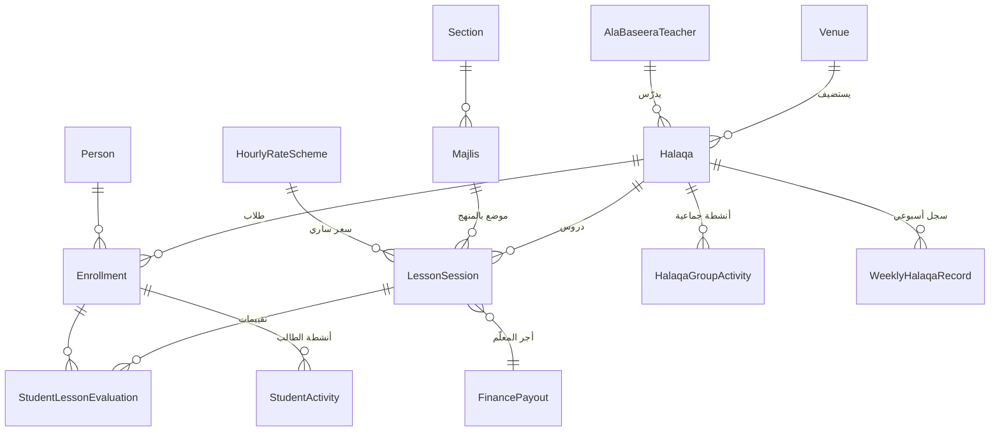

# وحدة «كتاب على بصيرة» — التدريس والحلقات والتقييم والمحاسبة بالساعة

**الإصدار:** 0.2 (محدّثة بالجولة الثانية) — **المرجع:** [ق8](05_decisions_log.md)/[ق8-ب] · [ق9](05_decisions_log.md)/[ق9-ب]
**المصادر:** «على بصيرة — منهاج التعليم الشبابي الأسري» (المرحلة الأولى، 1446هـ، ~20 مجلساً في 6 أقسام) · «سجل كتاب على بصيرة» (Excel)

---

## 1. لماذا وحدة مستقلة؟

«على بصيرة» **مسار رواتب ثانٍ مستقل عن نظام نقاط المسجد**:

| البُعد | مسار المسجد المؤثر | مسار «على بصيرة» |
|---|---|---|
| من يُحاسَب | المسجد (نشاط جماعي للأسرة) | **المعلّم نفسه** |
| الوحدة | النقطة (هدف 70/أسبوع) | **الساعة الدراسية** |
| المعدل | معدل النقطة بالمال (ق2) | **سعر الساعة** (مثلاً 2$ — قابل للتعديل من قاعدة البيانات: 1.5$/3$…) |
| ماذا يُرفع | «دُرّس على بصيرة» = **نقطة واحدة** للمسجد (استضافة فقط، قيمة زهيدة) | **تقرير درس** مفصّل + تقييم طلاب + أنشطة حلقة |

> القاعدة الحاكمة: المسجد يأخذ نقطة لأنه استضاف الدرس؛ أما **المعلّم المتعاقَد** فيُحاسَب على **ساعاته الفعلية فقط** (لا حوافز أداء مدمجة).

> **المحاسبة بحسب الوصف وتُجمع (ق8-ب):** الشخص الذي وصفه «معلّم على بصيرة» فقط ⇒ بالساعة. ومن جمع وصفين (معلّم **و** أمير مسجد له نشاط إداري) ⇒ يأخذ **مسار الساعات + مسار النقاط معاً** (انظر [وحدة المالية §2](07_module_finance.md)).

## 2. الكيانات

### AlaBaseeraTeacher — معلّم «على بصيرة»
person_id · المؤهل/الإجازة · حالة التعاقد · **سعر الساعة الساري** (يشير إلى إصدار `HourlyRateScheme`) · المساجد/المعاهد التي يدرّس فيها

### Halaqa — الحلقة
| حقل | ملاحظة |
|---|---|
| id, name | — |
| venue_id | المكان (مسجد أو **معهد** — انظر ق9) |
| gender_track | رجالي/نسائي |
| teacher_id(s) | معلّم أو أكثر ومادته (من رأس السجل: «أسماء معلمي/ات الحلقة وموادهم») |
| capacity | حتى ~30 طالباً (من بنية السجل) |
| schedule | أيام/أوقات |

### Venue / Institute — المكان/المعهد (ق9-ب)
type (مسجد/معهد/بيت)، name، org_unit_id. **المعهد مجرد مكان لانعقاد الحلقات، وليس كياناً إدارياً مستقلاً** (لا تقارير إدارية ولا إشراف منّا — ق9-ب)؛ قد يضم 200–400 طالباً وعدة حلقات. المؤسسة تتكفّل بالرواتب فقط، وإدارة المعهد تتدبّر باقي التشغيل، مع حوافز تشغيلية اختيارية عند الحاجة.

### Curriculum → Section → Majlis — المنهج
6 أقسام · ~20 مجلساً · كل مجلس يحوي مكوناته (سورة، عقيدة، فقه، تربية). يُستخدم لربط الدرس بموضعه في المنهج وتتبّع التقدّم.

### Student / Enrollment — الطالب وتسجيله
person_id · halaqa_id · تاريخ الالتحاق · الحالة. (الطالب شخص في النظام، قد يكون أيضاً شاب مسجد أو مشترك مسابقة — مع منع ازدواج الاحتساب، ق9.)

### LessonSession — جلسة الدرس (أساس المحاسبة بالساعة)
| حقل | ملاحظة |
|---|---|
| halaqa_id, teacher_id | — |
| date_hijri, day | اليوم والتاريخ (السجل يرصد 3 دروس/أسبوع) |
| majlis_id, lesson_title | «عنوان الدرس» + موضعه بالمنهج |
| duration_hours | **أساس حساب الأجر** = الساعات × سعر الساعة |
| materials, report | «ما دُرّس، المواد، المعايير» (تقرير المعلّم) |
| status | مُدخل → مُقرّ من الإشراف → معتمد مالياً |

### StudentLessonEvaluation — تقييم الطالب في الدرس
enrollment_id, lesson_session_id, score/level, note. (السجل: «تقييم الطالب في الدرس» لكل درس من الثلاثة.)

### StudentActivity — نشاط تربوي للطالب خارج الحلقة
enrollment_id, week, description, points? (السجل: «نشاطات تربوية أداها الطالب خارج الحلقة».)

### HalaqaGroupActivity — نشاط جماعي للحلقة بإشراف المعلّم
halaqa_id, week, seq (حتى 5)، description, date. (أمثلة السجل: زيارة مريض، درس عام لشيخ ضيف، دورة شرعية/تقنية، جولات دعوية وتوزيع مطويات، نشاط رياضي/ترفيهي، تنظيف، عقد قران، ملتقى طلابي، تدريب رياضي، نشاط قرآني.)

### WeeklyHalaqaRecord — سجل الحلقة الأسبوعي
يجمع جلسات الأسبوع + تقييمات الطلاب + الأنشطة الجماعية + **ملاحظات فريق الإشراف** + **ملاحظات الإدارة العامة** (الحقلان من ذيل السجل).

### HourlyRateScheme — إصدار سعر الساعة
rate, currency, valid_from. (قابل للتعديل دون كسر التاريخ — كل `LessonSession` يشير للإصدار الساري وقتها، كما في `PointsScheme`.)

## 3. المخطط العلائقي

## 4. المحاسبة (تتكامل مع وحدة المالية)

- **أجر المعلّم الشهري** = Σ(ساعات جلساته المعتمدة × سعر الساعة الساري). **لا خصومات** (ق4-ب)؛ حوافز تشغيلية اختيارية فقط عند الحاجة (ق9-ب).
- يُجمع مع مسار نقاطه إن كان أيضاً أمير مسجد (ق8-ب).
- يدخل ضمن الملف المالي للشخص ثم المسجد فالمحافظة في [07_module_finance](07_module_finance.md).
- منفصل عن نقاط المسجد؛ المسجد يأخذ نقطته الواحدة على الاستضافة فقط.

## 5. الأدوار في هذه الوحدة

| دور | صلاحية |
|---|---|
| معلّم «على بصيرة» | يُدخل جلسات الدرس وتقاريرها وتقييمات طلابه وأنشطة حلقته |
| فريق الإشراف | يُقرّ جلسات/تقييمات الحلقة (حقل «ملاحظات فريق الإشراف») |
| الإدارة العامة | تطّلع وتعتمد + «ملاحظات الإدارة العامة» + الاعتماد المالي وسعر الساعة |
| أمير المسجد/المعهد | يطّلع على حلقات مكانه (لا يُحاسَب عليها) |

## 6. حالات الحواف

- معلّم يدرّس في أكثر من حلقة/مكان: الأجر يُجمع عبر كل جلساته.
- حلقة بمعلّمَين: كل معلّم يحاسَب على ساعاته هو.
- طالب مشترك في عدة أنشطة/معهد: **يُحتسب النشاط مرة واحدة** فقط (منع الازدواج، ق9).
- تغيّر سعر الساعة: يسري من تاريخه ولا يُعاد حساب جلسات سابقة.

## 7. ملاحظات محسومة (الجولة الثانية)

- ✅ المعلّم بالساعة **فقط** (لا حوافز أداء) — ق8-ب.
- ✅ المعهد **مجرد مكان** لا كيان إداري — ق9-ب.
- تقييم الطالب: **متابعة تربوية** (بلا أثر مالي حالياً) — يُبقى للجودة لا للمحاسبة.
