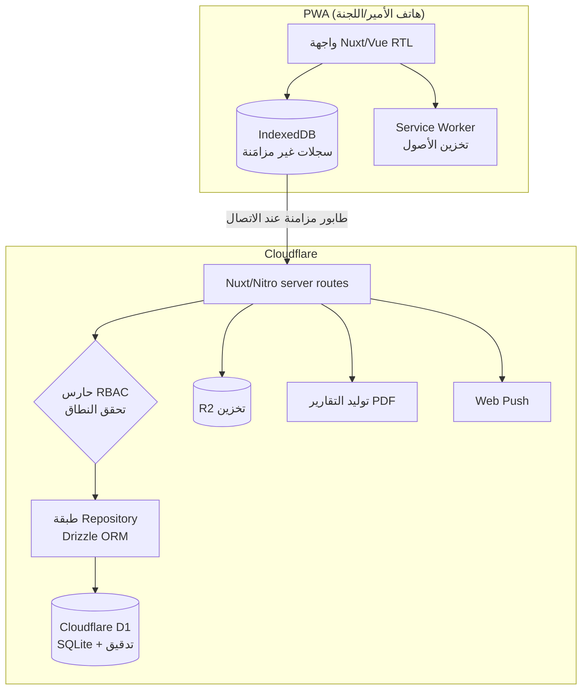

# خطة البناء التقنية — المرحلة 0 + 1

**الإصدار:** 0.3 (تحوّل إلى Nuxt + Cloudflare D1 — كل شيء على Cloudflare)
**النطاق:** الأساس (الهيكلية، التسجيل، الصلاحيات) + MVP النقاط (السجل، اللجان، الاعتماد، مساري الجنسين، اللوحات، التقارير)
**المراجع:** [01_vision](01_vision.md) · [03_data_model](03_data_model.md) · [05_decisions_log](05_decisions_log.md)

> **قرار المالك (يونيو 2026):** اعتماد **Nuxt** للخادم و**Cloudflare D1** لقاعدة البيانات، وكل الخدمات على Cloudflare. هذا **تنازل مقصود ومقبول عن نقل البيانات لخادم خاص** (D1 تعيش على Cloudflare فقط) مقابل بساطة الإعداد ووحدة المنصة وصفر تكلفة. أُبلغ المالك بهذا الأثر صراحةً واختاره.

---

## 1. المبادئ التقنية الحاكمة (من المتطلبات)

| المتطلب | الانعكاس التقني |
|---|---|
| Offline-first (اتصالات سوريا) | PWA + تخزين محلي (IndexedDB) + طابور مزامنة بمعرّف `client_uuid` idempotent |
| عربي RTL + هجري أساسي | RTL في كل الطبقة، مكتبة هجرية موحّدة خادم/عميل، تخزين التاريخين |
| بساطة الإدخال (دقيقتان) | حِزَم صغيرة، شاشات خفيفة، تفاعل لحظي بلا انتظار شبكة |
| توسّع (آلاف المساجد) | شجرة هيكلية بـ«المسار المادي» (Materialized Path نصّي) واستعلام `LIKE`، ترقيم صفحات، فهارس على النطاق |
| أمن صارم | RBAC على **كل** نقطة API (لا الواجهة فقط)، تشفير، سجل تدقيق |
| إعداد لا كود | جداول إعدادات مُصدَّرة (نقاط/معدلات) versioned |

## 2. حزمة التقنية المعتمدة (Nuxt + Cloudflare)

| الطبقة | الاختيار | السبب |
|---|---|---|
| الإطار (واجهة + خادم) | **Nuxt 3 (TypeScript)** — الواجهة Vue + خادم Nitro موحّد | إطار واحد للواجهة وAPI، يدعم Dashboard والصلاحيات بأناقة، ويُنشر على Cloudflare افتراضياً |
| PWA / التخزين المحلي | **@vite-pwa/nuxt** + **IndexedDB عبر Dexie.js** | عمل دون اتصال وطابور مزامنة |
| التنسيق | Tailwind CSS مع إضافة RTL + خط عربي (Cairo/IBM Plex Arabic) | RTL سريع ومتسق |
| قاعدة البيانات | **Cloudflare D1** (SQLite) + **Drizzle ORM** | تكامل افتراضي مع Workers، إعداد فوري، Drizzle يدعم D1 جيداً |
| التشغيل/النشر | **Cloudflare Workers/Pages** عبر Wrangler | كل شيء على Cloudflare، HTTPS ودومين فوري |
| التخزين | **Cloudflare R2** (متوافق S3) | مرفقات/صور لاحقاً |
| المصادقة | جلسات/JWT في Nitro server routes + **RBAC في middleware خادمي** | تحقق نطاقي على كل طلب API |
| التواريخ الهجرية | مكتبة موحّدة (مثل `@umalqura`) خادم+عميل | منع اختلاف الحساب بين الأجهزة |
| التقارير PDF | توليد من قالب HTML RTL (متوافق مع بيئة Workers) | تقرير عربي قابل للطباعة والإرسال |
| الإشعارات | **Web Push (VAPID) + بوت تيليغرام** | مجاني؛ تيليغرام قناتكم الحالية. لا SMS مدفوع الآن |

## 2.ب الاستضافة: كل شيء على Cloudflare (مرحلة واحدة)

| المكوّن | الخدمة |
|---|---|
| الواجهة + الخادم (Nuxt) | Cloudflare Pages/Workers |
| قاعدة البيانات | Cloudflare D1 |
| التخزين | Cloudflare R2 |
| CDN/حماية/HTTPS/الدومين | Cloudflare |

- **مزايا:** إعداد فوري، صفر تكلفة بنية تحتية ضمن الباقة المجانية، منصة موحّدة، أداء جيد لسوريا عبر شبكة Cloudflare.
- **التنازل المقبول (مقصود):** البيانات تبقى على Cloudflare ولا يمكن نقلها لخادم خاص (D1 حصرية لـCloudflare). إن تغيّرت الأولوية مستقبلاً نحو السيادة، فالانتقال D1→Postgres يتطلب إعادة كتابة طبقة البيانات — قرار يُتخذ حينها بوعي.
- **تخفيف المخاطرة:** عزل منطق الوصول للبيانات في **طبقة Repository واحدة** عبر Drizzle، فلو لزم تبديل قاعدة البيانات لاحقاً يكون التغيير محصوراً فيها لا منثوراً في الكود.
- **ملاحظة:** Offline-first مستقل عن المضيف — يُحَل في الـPWA (IndexedDB).

## 3. المعمارية (نظرة عامة)

## 4. قرارات تقنية مفصّلة

- **الهيكلية:** `OrgUnit` بعمود **مسار مادّي نصّي** (مثل `/1/4/12/`)؛ استعلام «كل ما تحت نطاقي» = `path LIKE '/1/4/%'` (D1/SQLite يدعم أيضاً `WITH RECURSIVE` عند الحاجة). كل استعلام مقيّد بنطاق المستخدم عبر طبقة وسيطة.
- **المزامنة:** العميل يولّد `client_uuid` لكل إدخال؛ الخادم idempotent (نفس الـuuid لا يُكرَّر). تعارض نفس (مسجد، يوم، نشاط) ← آخر كتابة تكسب، والنسخ في `AuditLog`.
- **قفل الأسبوع (ق5):** بعد القفل، الـAPI يرفض تعديل الإدخالات للمسؤول المباشر (يسمح بإضافة جديدة فقط)؛ التعديل يتطلب دور كتلة/محافظة فأعلى.
- **سلسلة الاعتماد (ق1):** حقل حالة على الإدخال (مُدخل→مُقرّ من الأمير→مُقرّ من أعلى طبقة مفعّلة)؛ «أعلى طبقة مفعّلة» تُحسب = أعلى تكليف نشط في سلسلة آباء المسجد (المسار المادّي).
- **طبقة Repository:** كل وصول للبيانات عبر Drizzle في طبقة واحدة معزولة — تبسّط الاختبار وتحصر أي تبديل مستقبلي لقاعدة البيانات.
- **مساري الجنسين (ق6):** `ActivityType.gender_track` + `PointsScheme` مستقل لكل مسار؛ الواجهة تحمّل المجموعة بحسب جنس المسجد.
- **النقاط/المال (ق2):** الحساب يُشتق دائماً من الإدخالات × إصدار المعدّل الساري؛ لا تخزين مبالغ مجمّدة إلا عند الصرف (المرحلة 2).

## 5. تقسيم السباقات (Sprints) — أسبوعان لكل سباق

| السباق | المخرجات | محك الإنجاز |
|---|---|---|
| **S1 — الأساس أ** | مشروع Nuxt + إعداد Wrangler/D1/Drizzle، PWA shell، المصادقة، التسجيل الذاتي (ق4)، نموذج `OrgUnit` بالمسار المادّي | تسجيل دخول ومستخدم يرى هيكلاً تجريبياً، ونشر أولي على Cloudflare |
| **S2 — الأساس ب** | RBAC نطاقي على كل API، منح الأدوار، استيراد مساجد إدلب من Excel، أعضاء الأسرة واللجان | مسؤول مربع لا يرى خارج نطاقه (اختبار آلي) |
| **S3 — السجل أ** | شاشة «سجل اليوم» offline (IndexedDB)، الأنشطة الثمانية، حساب النقاط، إقرار الشورى | إدخال كامل بلا إنترنت ثم مزامنة |
| **S4 — السجل ب** | إدخال اللجان بنطاقها، سلسلة الاعتماد (ق1)، قفل الأسبوع (ق5)، مساري الجنسين (ق6) | لجنة→أمير→أعلى طبقة، ومسار نساء يعمل |
| **S5 — اللوحات** | لوحات المسجد/المربع/المحافظة، رصد المتأخرين، Web Push للتذكير | مسؤول إدلب يرى مساجده لحظياً |
| **S6 — التقارير والتصلّب** | التقرير الشهري المولّد + اعتماد + PDF، إعدادات النقاط، تصلّب أمني، نسخ احتياطي | تقرير يُولَّد ويُعتمد ويُصدَّر PDF |

**ثم:** تجربة موجهة على محافظة إدلب (4–6 أسابيع) ← بوابة قرار ← المرحلة 2 (المالية).

## 6. الفريق والجهد التقديري

| الدور | العدد |
|---|---|
| مطوّر Full-stack (TS/Nuxt/Vue/Cloudflare) | 2 |
| مصمم UX/UI (إتقان RTL شرط) | 1 |
| مدير المنتج التقني | أنت |
| ضمان جودة (QA) | جزئي |

- **البناء (S1–S6):** ~12 أسبوعاً.
- **التجربة الموجهة:** 4–6 أسابيع متداخلة جزئياً.
- **منتج عامل ميدانياً:** ~4 أشهر؛ تعميم على بقية المحافظات بعدها تدريجياً.

## 7. المخاطر التقنية وتخفيفها

| الخطر | التخفيف |
|---|---|
| تعقيد المزامنة Offline | تثبيت نموذج idempotent + last-write-wins مبكراً (S3) واختباره بسيناريوهات انقطاع |
| حواف RTL/الهجري | مكتبة هجرية موحّدة + مراجعة بصرية عربية في كل سباق |
| ضعف الباندويث | حِزَم مقسّمة (code-splitting)، تخزين الأصول، صور خفيفة |
| التبنّي الميداني | قيمة فورية للأمير (تقرير يتولّد) + بساطة + بطل منصة في كل كتلة |
| **قفل البيانات على Cloudflare (D1)** | عزل الوصول في طبقة Repository واحدة (Drizzle)؛ نسخ احتياطي دوري عبر تصدير D1؛ القرار مقبول بوعي |
| حدود بيئة Workers (لا Node كامل) | اختيار مكتبات متوافقة مع Workers (PDF/الهجري/Web Push) والتحقق منها في S1 |
| أمن بيانات حساسة | RBAC على API، تدقيق، حذف منطقي، مراجعة أمنية قبل الـPilot؛ تأكيد بقاء بيانات الإغاثة مؤجَّلة (المرحلة 4) |

## 8. قرارات تقنية محسومة

1. ✅ **الإطار: Nuxt 3** (واجهة Vue + خادم Nitro موحّد).
2. ✅ **قاعدة البيانات: Cloudflare D1** + Drizzle ORM؛ **كل الخدمات على Cloudflare** (Pages/Workers + D1 + R2). تنازل مقصود عن نقل البيانات لخادم خاص.
3. ✅ **الإشعارات: Web Push + بوت تيليغرام (لا SMS مدفوع الآن)** — يُعاد النظر في SMS فقط إن أظهر الـPilot أن التذكيرات لا تصل.

**يبقى للحسم لاحقاً (غير حاجز لـS1):** سياسة الاحتفاظ بالبيانات · إعداد النسخ الاحتياطي لـD1.
